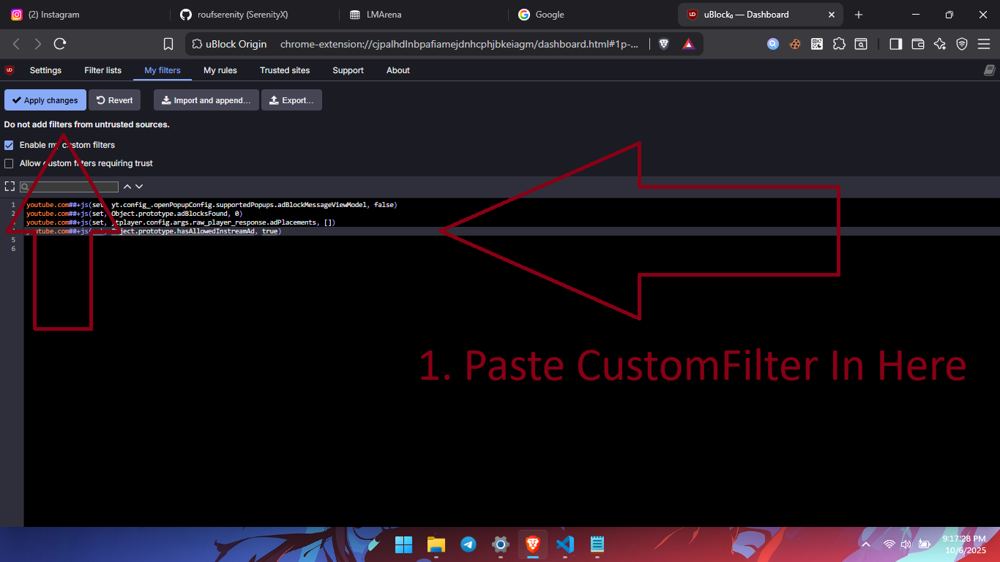

# Youtube Premium Extensions by Rouf Swevaga

### 🇮🇩 Tentang Repositori Ini
Repositori ini adalah panduan lengkap yang berisi kumpulan ekstensi browser pilihan untuk memberikan pengalaman menonton YouTube yang bebas iklan dan kaya fitur, layaknya YouTube Premium, namun secara gratis. Dengan mengikuti salah satu metode yang disediakan, Anda dapat menikmati fitur seperti pemblokiran iklan, melewati segmen sponsor, mengembalikan tombol dislike, dan mengubah tampilan logo YouTube.

⚠️ **Disclaimer:** Metode yang dijelaskan di sini bersifat edukasional. Ekstensi ini bukan produk resmi dari YouTube dan dapat berhenti berfungsi jika YouTube melakukan pembaruan. Harap gunakan dengan bijak. Jika Anda mampu, pertimbangkan untuk berlangganan YouTube Premium untuk mendukung platform dan para kreator.

### 🇬🇧 About This Repository
This repository is a comprehensive guide containing a collection of selected browser extensions to provide an ad-free and feature-rich YouTube viewing experience, similar to YouTube Premium, but for free. By following one of the provided methods, you can enjoy features like ad-blocking, skipping sponsor segments, bringing back the dislike button, and changing the YouTube logo's appearance.

⚠️ **Disclaimer:** The methods described here are for educational purposes. These extensions are not official YouTube products and may stop working if YouTube applies updates. Please use them wisely. If you can afford it, consider subscribing to YouTube Premium to support the platform and its creators.

### 🇨🇳 关于此仓库
本仓库是一份综合指南，包含一系列精选的浏览器扩展，旨在免费提供类似于 YouTube Premium 的无广告、功能丰富的观看体验。通过遵循所提供的方法之一，您可以享受广告拦截、跳过赞助商片段、恢复踩按钮以及更改 YouTube 标志外观等功能。

⚠️ **免责声明：** 此处描述的方法仅用于教育目的。这些扩展并非 YouTube 官方产品，如果 YouTube 进行更新，可能会停止工作。请明智使用。如果经济条件允许，请考虑订阅 YouTube Premium 以支持平台和创作者。

### 🇯🇵 このリポジトリについて
このリポジトリは、YouTube Premiumのように広告なしで多機能な視聴体験を無料で提供するための、厳選されたブラウザ拡張機能のコレクションを含む包括的なガイドです。提供されているいずれかの方法に従うことで、広告ブロック、スポンサーセグメントのスキップ、低評価ボタンの復活、YouTubeロゴの外観変更といった機能をお楽しみいただけます。

⚠️ **免責事項：** ここで説明されている方法は教育目的のものです。これらの拡張機能はYouTubeの公式製品ではなく、YouTubeがアップデートを行うと機能しなくなる可能性があります。賢明にご利用ください。もし余裕があれば、プラットフォームとクリエイターを支援するためにYouTube Premiumへの加入をご検討ください。

---

## Pilih Bahasa / Select Language / 选择语言 / 言語を選択

[🇮🇩 Indonesia](#indonesia) | [🇬🇧 English](#english) | [🇨🇳 简体中文](#简体中文) | [🇯🇵 日本語](#日本語)

---

## 🇮🇩 Indonesia

Kumpulan ekstensi browser untuk mendapatkan pengalaman seperti YouTube Premium secara gratis.

**Penting:** Cara ini hanya berfungsi pada browser berbasis Chromium (seperti Google Chrome, Brave, Opera, Microsoft Edge, dll).

### ✨ Tampilan Akhir

---

### Cara 1: Untuk Browser Standar (Contoh: Google Chrome)

1.  **Gunakan Browser Chrome Versi Terbaru.**
    *   [Unduh Google Chrome di sini](https://chromeenterprise.google/intl/id_id/download/)

2.  **Unduh Ekstensi Berikut:**
    *   [SponsorBlock](https://chrome.google.com/webstore/detail/sponsorblock-for-YouTube%E2%84%A2/mnjggcdmjocbbbhaepdhchncahnbgone)
    *   [Return Youtube Dislike](https://chrome.google.com/webstore/detail/return-youtube-dislike/gebbhagfogifgggkldgodflihgfeippi)
    *   [Enhancer for YouTube™](https://chrome.google.com/webstore/detail/enhancer-for-YouTube%E2%84%A2/ponfpcnoihfmfllpaingbgckeeldkhle)
    *   [Ghostery Tracker & Ad Blocker](https://chromewebstore.google.com/detail/ghostery-tracker-ad-block/mlomiejdfkolichcflejclcbmpeaniij)
    *   [CustomBlocker](https://chromewebstore.google.com/detail/customblocker/fkeliajcchpanffhmbacpfdgjbmocfpj)
    *   **Fake Youtube Premium**: [Unduh di sini](https://bicolink.com/wCMC9sLst) (berbentuk file `.zip`)

3.  **Instal Ekstensi "Fake Youtube Premium"**
    *   Ekstrak file `.zip` yang sudah diunduh.
    *   Buka browser Chrome Anda, lalu ketik `chrome://extensions/` di address bar dan tekan Enter.
    *   Aktifkan **Mode Developer** (pojok kanan atas).
    *   Klik **Muat yang belum dibuka** (Load unpacked) dan pilih folder hasil ekstrak tadi.

4.  **Pengaturan AdBlock (Menggunakan CustomBlocker)**
    *   Ikuti 5 langkah pada gambar di bawah ini untuk memblokir iklan YouTube.

    | Langkah 1 | Langkah 2 |
    | :---: | :---: |
    |  |  |
    | **Langkah 3** | **Langkah 4** |
    |  |  |
    | **Langkah 5 (Hasil Akhir)** |
    |  |

---

### Cara 2: Untuk Browser Brave (Lebih Mudah & Efektif)

1.  **Gunakan Browser Brave.**
    *   [Unduh Brave di sini](https://vancedapp.com/brave) (Brave sudah memiliki AdBlock bawaan yang kuat).

2.  **Unduh Ekstensi Berikut:**
    *   [SponsorBlock](https://chrome.google.com/webstore/detail/sponsorblock-for-YouTube%E2%84%A2/mnjggcdmjocbbbhaepdhchncahnbgone)
    *   [Return Youtube Dislike](https://chrome.google.com/webstore/detail/return-youtube-dislike/gebbhagfogifgggkldgodflihgfeippi)
    *   [Enhancer for YouTube™](https://chrome.google.com/webstore/detail/enhancer-for-YouTube%E2%84%A2/ponfpcnoihfmfllpaingbgckeeldkhle)
    *   **uBlock Origin**: [Unduh versi terbaru di sini](https://github.com/gorhill/uBlock/releases) (unduh file `uBlock0.chromium.zip`)
    *   **Fake Youtube Premium**: [Unduh di sini](https://bicolink.com/wCMC9sLst) (berbentuk file `.zip`)

3.  **Instal Ekstensi Manual (`.zip`)**
    *   Ekstrak semua file `.zip` (uBlock Origin & Fake Premium) ke folder terpisah.
    *   Buka browser Brave, lalu ketik `brave://extensions/` di address bar dan tekan Enter.
    *   Aktifkan **Mode Developer**.
    *   Klik **Muat yang belum dibuka** dan pilih folder hasil ekstrak satu per satu.
    *   Refresh browser Anda dan nikmati YouTube seperti Premium! 🎉

4.  **Pengaturan AdBlock (Brave Shield & uBlock Origin)**
    *   Ikuti 5 langkah pada gambar di bawah ini untuk memblokir iklan YouTube.

    | Langkah 1 | Langkah 2 |
    | :---: | :---: |
    |  |  |
    | **Langkah 3** | **Langkah 4** |
    |  |  |
    | **Langkah 5 (Hasil Akhir)** |
    |  |

💡 **Fitur Tambahan:** Ekstensi "Fake Youtube Premium" akan mengubah logo YouTube biasa menjadi logo YouTube Premium.

---
---

## 🇬🇧 English

A collection of browser extensions to get a YouTube Premium-like experience for free.

**Important:** This method only works on Chromium-based browsers (like Google Chrome, Brave, Opera, Microsoft Edge, etc.).

### ✨ Final Look

---

### Method 1: For Standard Browsers (e.g., Google Chrome)

1.  **Use the Latest Version of Chrome.**
    *   [Download Google Chrome here](https://chromeenterprise.google/intl/en_us/download/)

2.  **Download the Following Extensions:**
    *   [SponsorBlock](https://chrome.google.com/webstore/detail/sponsorblock-for-YouTube%E2%84%A2/mnjggcdmjocbbbhaepdhchncahnbgone)
    *   [Return Youtube Dislike](https://chrome.google.com/webstore/detail/return-youtube-dislike/gebbhagfogifgggkldgodflihgfeippi)
    *   [Enhancer for YouTube™](https://chrome.google.com/webstore/detail/enhancer-for-YouTube%E2%84%A2/ponfpcnoihfmfllpaingbgckeeldkhle)
    *   [Ghostery Tracker & Ad Blocker](https://chromewebstore.google.com/detail/ghostery-tracker-ad-block/mlomiejdfkolichcflejclcbmpeaniij)
    *   [CustomBlocker](https://chromewebstore.google.com/detail/customblocker/fkeliajcchpanffhmbacpfdgjbmocfpj)
    *   **Fake Youtube Premium**: [Download here](https://bicolink.com/wCMC9sLst) (as a `.zip` file)

3.  **Install the "Fake Youtube Premium" Extension**
    *   Extract the downloaded `.zip` file.
    *   Open your Chrome browser, type `chrome://extensions/` in the address bar and press Enter.
    *   Enable **Developer Mode** (top right corner).
    *   Click **Load unpacked** and select the extracted folder.

4.  **AdBlock Setup (Using CustomBlocker)**
    *   Follow the 5 steps in the images below to block YouTube ads.

    | Step 1 | Step 2 |
    | :---: | :---: |
    |  |  |
    | **Step 3** | **Step 4** |
    |  |  |
    | **Step 5 (Final Result)** |
    |  |

---

### Method 2: For Brave Browser (Easier & More Effective)

1.  **Use the Brave Browser.**
    *   [Download Brave here](https://vancedapp.com/brave) (Brave has a powerful built-in AdBlock).

2.  **Download the Following Extensions:**
    *   [SponsorBlock](https://chrome.google.com/webstore/detail/sponsorblock-for-YouTube%E2%84%A2/mnjggcdmjocbbbhaepdhchncahnbgone)
    *   [Return Youtube Dislike](https://chrome.google.com/webstore/detail/return-youtube-dislike/gebbhagfogifgggkldgodflihgfeippi)
    *   [Enhancer for YouTube™](https://chrome.google.com/webstore/detail/enhancer-for-YouTube%E2%84%A2/ponfpcnoihfmfllpaingbgckeeldkhle)
    *   **uBlock Origin**: [Download the latest version here](https://github.com/gorhill/uBlock/releases) (download the `uBlock0.chromium.zip` file)
    *   **Fake Youtube Premium**: [Download here](https://bicolink.com/wCMC9sLst) (as a `.zip` file)

3.  **Install Manual Extensions (`.zip`)**
    *   Extract all `.zip` files (uBlock Origin & Fake Premium) into separate folders.
    *   Open the Brave browser, type `brave://extensions/` in the address bar and press Enter.
    *   Enable **Developer Mode**.
    *   Click **Load unpacked** and select the extracted folders one by one.
    *   Refresh your browser and enjoy your Premium-like YouTube! 🎉

4.  **AdBlock Setup (Brave Shield & uBlock Origin)**
    *   Follow the 5 steps in the images below to block YouTube ads.

    | Step 1 | Step 2 |
    | :---: | :---: |
    |  |  |
    | **Step 3** | **Step 4** |
    |  |  |
    | **Step 5 (Final Result)** |
    |  |

💡 **Bonus Feature:** The "Fake Youtube Premium" extension will change the standard YouTube logo to the YouTube Premium logo.

---
---

## 🇨🇳 简体中文

一组浏览器扩展，可免费获得类似 YouTube Premium 的体验。

**重要提示：** 此方法仅适用于基于 Chromium 的浏览器（例如 Google Chrome、Brave、Opera、Microsoft Edge 等）。

### ✨ 最终效果

---

### 方法一：适用于标准浏览器（例如 Google Chrome）

1.  **使用最新版本的 Chrome 浏览器。**
    *   [在此处下载 Google Chrome](https://chromeenterprise.google/intl/zh_cn/download/)

2.  **下载以下扩展：**
    *   [SponsorBlock](https://chrome.google.com/webstore/detail/sponsorblock-for-YouTube%E2%84%A2/mnjggcdmjocbbbhaepdhchncahnbgone)
    *   [Return Youtube Dislike](https://chrome.google.com/webstore/detail/return-youtube-dislike/gebbhagfogifgggkldgodflihgfeippi)
    *   [Enhancer for YouTube™](https://chrome.google.com/webstore/detail/enhancer-for-YouTube%E2%84%A2/ponfpcnoihfmfllpaingbgckeeldkhle)
    *   [Ghostery Tracker & Ad Blocker](https://chromewebstore.google.com/detail/ghostery-tracker-ad-block/mlomiejdfkolichcflejclcbmpeaniij)
    *   [CustomBlocker](https://chromewebstore.google.com/detail/customblocker/fkeliajcchpanffhmbacpfdgjbmocfpj)
    *   **Fake Youtube Premium**：[在此处下载](https://bicolink.com/wCMC9sLst)（`.zip` 文件）

3.  **安装 "Fake Youtube Premium" 扩展**
    *   解压下载的 `.zip` 文件。
    *   打开您的 Chrome 浏览器，在地址栏中输入 `chrome://extensions/` 并按 Enter。
    *   启用 **开发者模式**（右上角）。
    *   点击 **加载已解压的扩展程序** 并选择解压后的文件夹。

4.  **广告拦截设置 (使用 CustomBlocker)**
    *   按照下图中的 5 个步骤操作，以屏蔽 YouTube 广告。

    | 步骤 1 | 步骤 2 |
    | :---: | :---: |
    |  |  |
    | **步骤 3** | **步骤 4** |
    |  |  |
    | **步骤 5 (最终结果)** |
    |  |

---

### 方法二：适用于 Brave 浏览器（更简单、更有效）

1.  **使用 Brave 浏览器。**
    *   [在此处下载 Brave](https://vancedapp.com/brave)（Brave 具有强大的内置广告拦截功能）。

2.  **下载以下扩展：**
    *   [SponsorBlock](https://chrome.google.com/webstore/detail/sponsorblock-for-YouTube%E2%84%A2/mnjggcdmjocbbbhaepdhchncahnbgone)
    *   [Return Youtube Dislike](https://chrome.google.com/webstore/detail/return-youtube-dislike/gebbhagfogifgggkldgodflihgfeippi)
    *   [Enhancer for YouTube™](https://chrome.google.com/webstore/detail/enhancer-for-YouTube%E2%84%A2/ponfpcnoihfmfllpaingbgckeeldkhle)
    *   **uBlock Origin**：[在此处下载最新版本](https://github.com/gorhill/uBlock/releases)（下载 `uBlock0.chromium.zip` 文件）
    *   **Fake Youtube Premium**：[在此处下载](https://bicolink.com/wCMC9sLst)（`.zip` 文件）

3.  **安装手动扩展 (`.zip`)**
    *   将所有 `.zip` 文件（uBlock Origin 和 Fake Premium）解压到单独的文件夹中。
    *   打开 Brave 浏览器，在地址栏中输入 `brave://extensions/` 并按 Enter。
    *   启用 **开发者模式**。
    *   点击 **加载已解压的扩展程序** 并逐个选择解压后的文件夹。
    *   刷新您的浏览器，享受您的 Premium 般的 YouTube！🎉

4.  **广告拦截设置 (Brave 护盾 & uBlock Origin)**
    *   按照下图中的 5 个步骤操作，以屏蔽 YouTube 广告。

    | 步骤 1 | 步骤 2 |
    | :---: | :---: |
    |  |  |
    | **步骤 3** | **步骤 4** |
    |  |  |
    | **步骤 5 (最终结果)** |
    |  |

💡 **附加功能：** "Fake Youtube Premium" 扩展会将标准的 YouTube 徽标更改为 YouTube Premium 徽标。

---
---

## 🇯🇵 日本語

無料でYouTube Premiumのような体験を得るためのブラウザ拡張機能のコレクションです。

**重要：** この方法は、Chromiumベースのブラウザ（Google Chrome、Brave、Opera、Microsoft Edgeなど）でのみ機能します。

### ✨ 最終的な外観

---

### 方法1：標準ブラウザ向け（例：Google Chrome）

1.  **最新バージョンのChromeを使用してください。**
    *   [Google Chromeをこちらからダウンロード](https://chromeenterprise.google/intl/ja_jp/download/)

2.  **以下の拡張機能をダウンロードしてください：**
    *   [SponsorBlock](https://chrome.google.com/webstore/detail/sponsorblock-for-YouTube%E2%84%A2/mnjggcdmjocbbbhaepdhchncahnbgone)
    *   [Return Youtube Dislike](https://chrome.google.com/webstore/detail/return-youtube-dislike/gebbhagfogifgggkldgodflihgfeippi)
    *   [Enhancer for YouTube™](https://chrome.google.com/webstore/detail/enhancer-for-YouTube%E2%84%A2/ponfpcnoihfmfllpaingbgckeeldkhle)
    *   [Ghostery Tracker & Ad Blocker](https://chromewebstore.google.com/detail/ghostery-tracker-ad-block/mlomiejdfkolichcflejclcbmpeaniij)
    *   [CustomBlocker](https://chromewebstore.google.com/detail/customblocker/fkeliajcchpanffhmbacpfdgjbmocfpj)
    *   **Fake Youtube Premium**: [こちらからダウンロード](https://bicolink.com/wCMC9sLst)（`.zip` ファイル形式）

3.  **「Fake Youtube Premium」拡張機能のインストール**
    *   ダウンロードした `.zip` ファイルを解凍します。
    *   Chromeブラウザを開き、アドレスバーに `chrome://extensions/` と入力してEnterキーを押します。
    *   **デベロッパーモード** を有効にします（右上にあります）。
    *   **パッケージ化されていない拡張機能を読み込む** をクリックし、解凍したフォルダを選択します。

4.  **広告ブロックの設定 (CustomBlockerを使用)**
    *   YouTube広告をブロックするために、以下の画像の5つの手順に従ってください。

    | ステップ 1 | ステップ 2 |
    | :---: | :---: |
    |  |  |
    | **ステップ 3** | **ステップ 4** |
    |  |  |
    | **ステップ 5 (最終結果)** |
    |  |

---

### 方法2：Braveブラウザ向け（より簡単で効果的）

1.  **Braveブラウザを使用してください。**
    *   [Braveをこちらからダウンロード](https://vancedapp.com/brave)（Braveには強力な広告ブロック機能が組み込まれています）。

2.  **以下の拡張機能をダウンロードしてください：**
    *   [SponsorBlock](https://chrome.google.com/webstore/detail/sponsorblock-for-YouTube%E2%84%A2/mnjggcdmjocbbbhaepdhchncahnbgone)
    *   [Return Youtube Dislike](https://chrome.google.com/webstore/detail/return-youtube-dislike/gebbhagfogifgggkldgodflihgfeippi)
    *   [Enhancer for YouTube™](https://chrome.google.com/webstore/detail/enhancer-for-YouTube%E2%84%A2/ponfpcnoihfmfllpaingbgckeeldkhle)
    *   **uBlock Origin**: [最新版をこちらからダウンロード](https://github.com/gorhill/uBlock/releases)（`uBlock0.chromium.zip` ファイルをダウンロード）
    *   **Fake Youtube Premium**: [こちらからダウンロード](https://bicolink.com/wCMC9sLst)（`.zip` ファイル形式）

3.  **手動で拡張機能をインストール (`.zip`)**
    *   すべての `.zip` ファイル（uBlock Origin と Fake Premium）を別々のフォルダに解凍します。
    *   Braveブラウザを開き、アドレスバーに `brave://extensions/` と入力してEnterキーを押します。
    *   **デベロッパーモード** を有効にします。
    *   **パッケージ化されていない拡張機能を読み込む** をクリックし、解凍したフォルダを一つずつ選択します。
    *   ブラウザをリフレッシュして、PremiumのようなYouTubeをお楽しみください！🎉

4.  **広告ブロックの設定 (Braveシールド & uBlock Origin)**
    | ステップ 1 | ステップ 2 |
    | :---: | :---: |
    |  |  |
    | **ステップ 3** | **ステップ 4** |
    |  |  |
    | **ステップ 5 (最終結果)** |
    |  |

💡 **追加機能：** 「Fake Youtube Premium」拡張機能は、標準のYouTubeロゴをYouTube Premiumロゴに変更します。