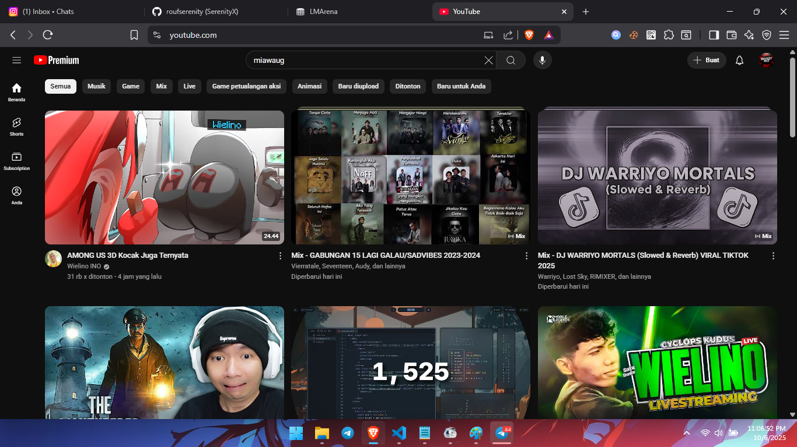
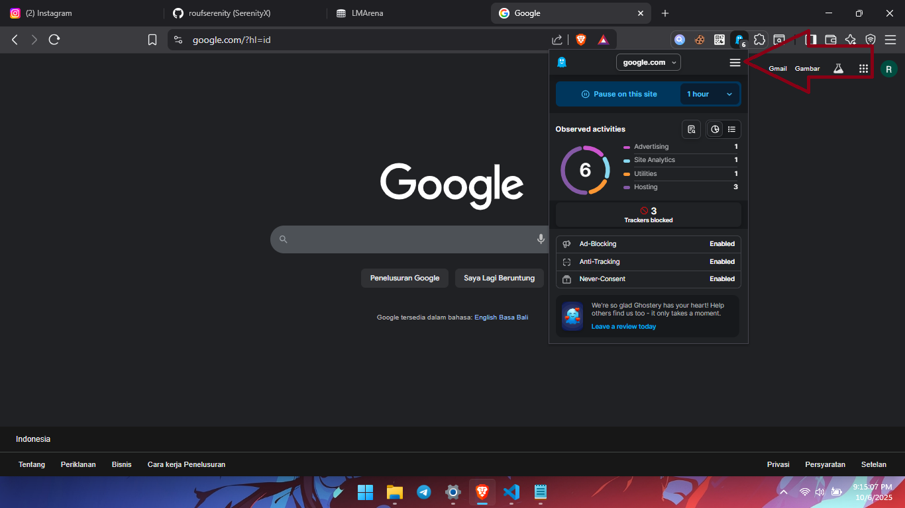
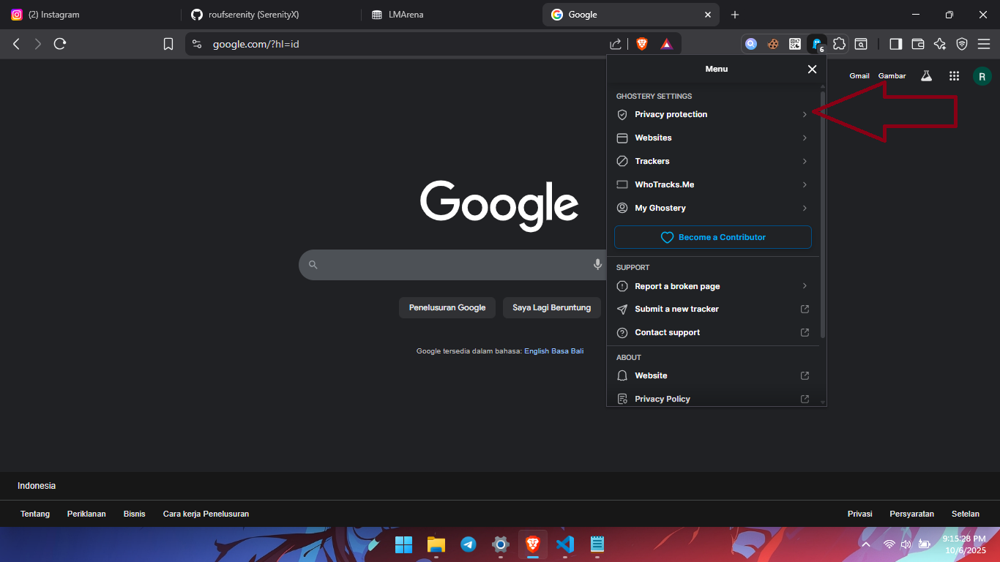
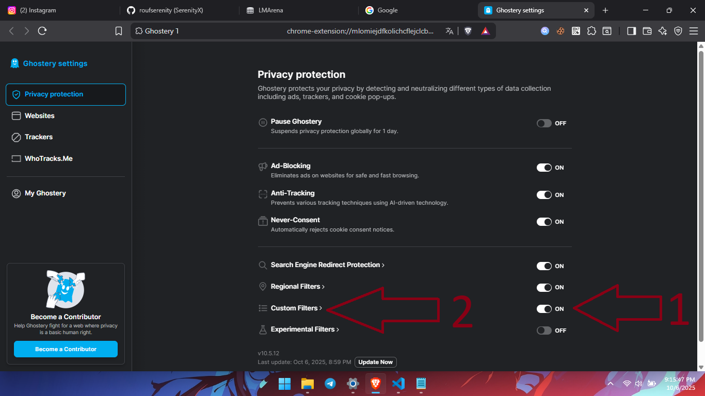
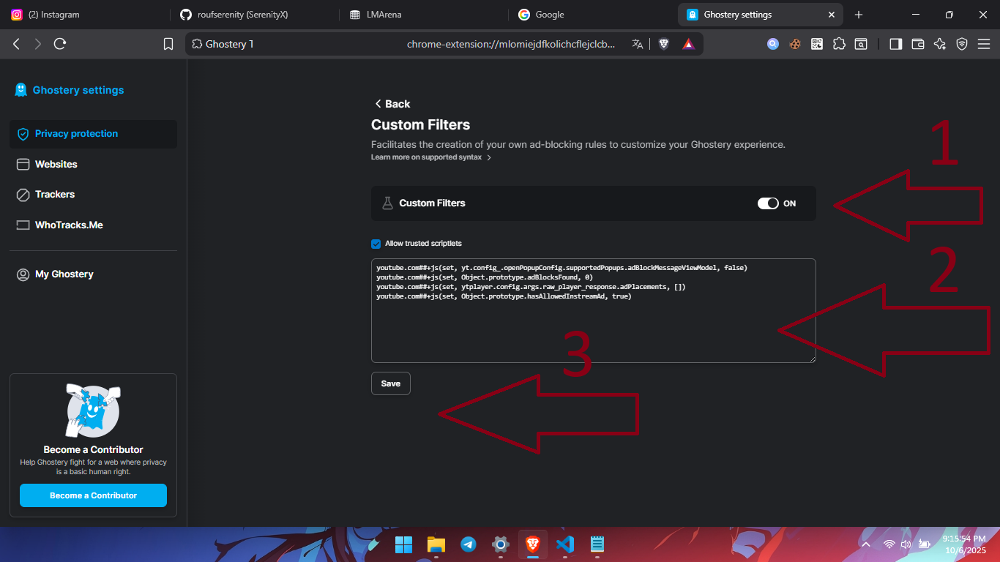
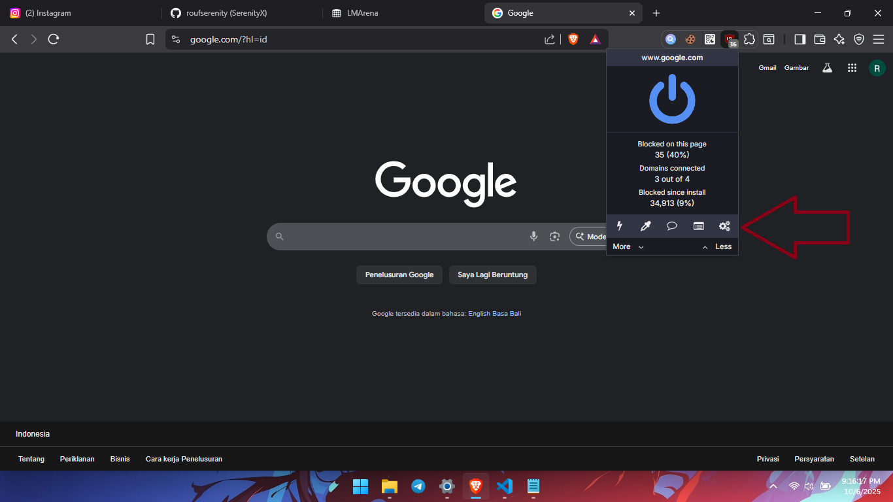
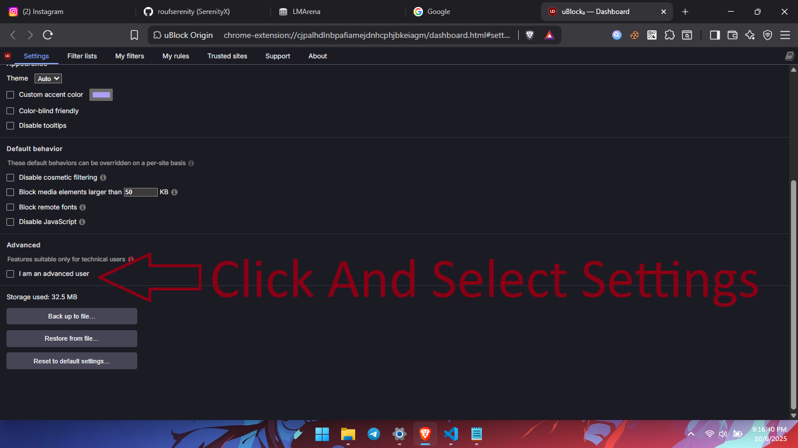
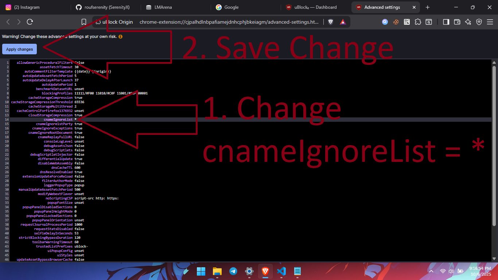
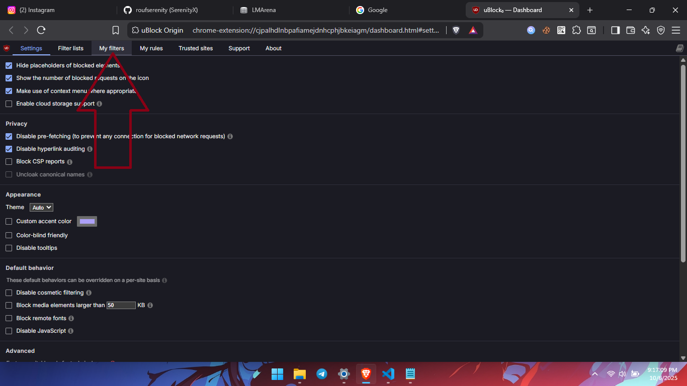

# Youtube Premium Extensions by Rouf Swevaga

### 🇮🇩 Tentang Repositori Ini
Repositori ini adalah panduan lengkap yang berisi kumpulan ekstensi browser pilihan untuk memberikan pengalaman menonton YouTube yang bebas iklan dan kaya fitur, layaknya YouTube Premium, namun secara gratis. Dengan mengikuti salah satu metode yang disediakan, Anda dapat menikmati fitur seperti pemblokiran iklan, melewati segmen sponsor, mengembalikan tombol dislike, dan mengubah tampilan logo YouTube.

⚠️ **Disclaimer:** Metode yang dijelaskan di sini bersifat edukasional. Ekstensi ini bukan produk resmi dari YouTube dan dapat berhenti berfungsi jika YouTube melakukan pembaruan. Harap gunakan dengan bijak. Jika Anda mampu, pertimbangkan untuk berlangganan YouTube Premium untuk mendukung platform dan para kreator.

### 🇬🇧 About This Repository
This repository is a comprehensive guide containing a collection of selected browser extensions to provide an ad-free and feature-rich YouTube viewing experience, similar to YouTube Premium, but for free. By following one of the provided methods, you can enjoy features like ad-blocking, skipping sponsor segments, bringing back the dislike button, and changing the YouTube logo's appearance.

⚠️ **Disclaimer:** The methods described here are for educational purposes. These extensions are not official YouTube products and may stop working if YouTube applies updates. Please use them wisely. If you can afford it, consider subscribing to YouTube Premium to support the platform and its creators.

---

## Pilih Bahasa / Select Language / 选择语言 / 言語を選択

[🇮🇩 Indonesia](#indonesia) | [🇬🇧 English](#english) | [🇨🇳 简体中文](#简体中文) | [🇯🇵 日本語](#日本語)

---

## 🇮🇩 Indonesia

Panduan untuk mendapatkan pengalaman seperti YouTube Premium secara gratis.

**Penting:** Cara ini hanya berfungsi pada browser berbasis Chromium (seperti Google Chrome, Brave, Opera, Microsoft Edge, dll).

### ✨ Tampilan Akhir

---

### Cara 1: Untuk Browser Standar (Contoh: Google Chrome)

1.  **Gunakan Browser Chrome Versi Terbaru.**
    *   [Unduh Google Chrome di sini](https://chromeenterprise.google/intl/id_id/download/)

2.  **Unduh Ekstensi Berikut:**
    *   [SponsorBlock](https://chrome.google.com/webstore/detail/sponsorblock-for-YouTube%E2%84%A2/mnjggcdmjocbbbhaepdhchncahnbgone)
    *   [Return Youtube Dislike](https://chrome.google.com/webstore/detail/return-youtube-dislike/gebbhagfogifgggkldgodflihgfeippi)
    *   [Enhancer for YouTube™](https://chrome.google.com/webstore/detail/enhancer-for-YouTube%E2%84%A2/ponfpcnoihfmfllpaingbgckeeldkhle)
    *   [Ghostery Tracker & Ad Blocker](https://chromewebstore.google.com/detail/ghostery-tracker-ad-block/mlomiejdfkolichcflejclcbmpeaniij)
    *   [CustomBlocker](https://chromewebstore.google.com/detail/customblocker/fkeliajcchpanffhmbacpfdgjbmocfpj)
    *   [Fake Youtube Premium](https://bicolink.com/gW2lkySrB) (berbentuk file `.zip`)
    *   [CustomFilter untuk uBlock](https://bicolink.com/Lw3BGqe) untuk mengunduh.

3.  **Instal Ekstensi Manual (`.zip`)**
    *   Ekstrak file `.zip` yang sudah diunduh.
    *   Buka browser Chrome (`chrome://extensions/`), aktifkan **Mode Developer** (pojok kanan atas).
    *   Klik **Muat yang belum dibuka** (Load unpacked) dan pilih folder hasil ekstrak tadi.

4.  **Pengaturan AdBlock (Menggunakan CustomBlocker)**
    *   Ikuti 5 langkah pada gambar di bawah ini untuk memblokir iklan YouTube.

    | Langkah 1 | Langkah 2 |
    | :---: | :---: |
    |  |  |
    | **Langkah 3** | **Langkah 4** |
    |  |  |
    | **Langkah 5 (Hasil Akhir)** |
    |  |

---

### Cara 2: Untuk Browser Brave (Lebih Efektif)

1.  **Gunakan Browser Brave.**
    *   [Unduh Brave di sini](https://vancedapp.com/brave) (sudah memiliki AdBlock bawaan).

2.  **Unduh Ekstensi & Filter Berikut:**
    *   [SponsorBlock](https://chrome.google.com/webstore/detail/sponsorblock-for-YouTube%E2%84%A2/mnjggcdmjocbbbhaepdhchncahnbgone)
    *   [Return Youtube Dislike](https://chrome.google.com/webstore/detail/return-youtube-dislike/gebbhagfogifgggkldgodflihgfeippi)
    *   [Enhancer for YouTube™](https://chrome.google.com/webstore/detail/enhancer-for-YouTube%E2%84%A2/ponfpcnoihfmfllpaingbgckeeldkhle)
    *   [uBlock Origin](https://github.com/gorhill/uBlock/releases) (unduh file `uBlock0.chromium.zip`)
    *   [Fake Youtube Premium](https://bicolink.com/gW2lkySrB) (berbentuk file `.zip`)
    *   [CustomFilter untuk uBlock](https://bicolink.com/Lw3BGqe) untuk mengunduh.

3.  **Instal Ekstensi Manual (`.zip`)**
    *   Ekstrak semua file `.zip` ke folder terpisah.
    *   Buka browser Brave (`brave://extensions/`), aktifkan **Mode Developer**.
    *   Klik **Muat yang belum dibuka** dan pilih folder hasil ekstrak satu per satu.

4.  **Pengaturan AdBlock (uBlock Origin + Custom Filter)**
    *   Ikuti langkah-langkah pada gambar untuk menambahkan filter kustom dan memaksimalkan pemblokiran iklan.

    | Langkah 1: Buka Dashboard | Langkah 2: Buka "Filter Saya" |
    | :---: | :---: |
    |  |  |
    | **Langkah 3: Salin-Tempel Filter** | **Langkah 4: Terapkan Perubahan** |
    |  |  |
    | **Langkah 5: Selesai!** Refresh YouTube & nikmati! 🎉|

💡 **Fitur Tambahan:** Ekstensi "Fake Youtube Premium" akan mengubah logo YouTube biasa menjadi logo YouTube Premium.

---
---

## 🇬🇧 English

Guide to get a YouTube Premium-like experience for free.

**Important:** This method only works on Chromium-based browsers (like Google Chrome, Brave, Opera, Microsoft Edge, etc.).

### ✨ Final Look

---

### Method 1: For Standard Browsers (e.g., Google Chrome)

1.  **Use the Latest Version of Chrome.**
    *   [Download Google Chrome here](https://chromeenterprise.google/intl/en_us/download/)

2.  **Download the Following Extensions:**
    *   [SponsorBlock](https://chrome.google.com/webstore/detail/sponsorblock-for-YouTube%E2%84%A2/mnjggcdmjocbbbhaepdhchncahnbgone)
    *   [Return Youtube Dislike](https://chrome.google.com/webstore/detail/return-youtube-dislike/gebbhagfogifgggkldgodflihgfeippi)
    *   [Enhancer for YouTube™](https://chrome.google.com/webstore/detail/enhancer-for-YouTube%E2%84%A2/ponfpcnoihfmfllpaingbgckeeldkhle)
    *   [Ghostery Tracker & Ad Blocker](https://chromewebstore.google.com/detail/ghostery-tracker-ad-block/mlomiejdfkolichcflejclcbmpeaniij)
    *   [CustomBlocker](https://chromewebstore.google.com/detail/customblocker/fkeliajcchpanffhmbacpfdgjbmocfpj)
    *   [Fake Youtube Premium](https://bicolink.com/gW2lkySrB) (as a `.zip` file)

3.  **Install Manual Extensions (`.zip`)**
    *   Extract the downloaded `.zip` file.
    *   Open Chrome (`chrome://extensions/`), enable **Developer Mode** (top right).
    *   Click **Load unpacked** and select the extracted folder.

4.  **AdBlock Setup (Using CustomBlocker)**
    *   Follow the 5 steps in the images below to block YouTube ads.

    | Step 1 | Step 2 |
    | :---: | :---: |
    |  |  |
    | **Step 3** | **Step 4** |
    |  |  |
    | **Step 5 (Final Result)** |
    |  |

---

### Method 2: For Brave Browser (More Effective)

1.  **Use the Brave Browser.**
    *   [Download Brave here](https://vancedapp.com/brave) (has a built-in AdBlock).

2.  **Download the Following Extensions & Filter:**
    *   [SponsorBlock](https://chrome.google.com/webstore/detail/sponsorblock-for-YouTube%E2%84%A2/mnjggcdmjocbbbhaepdhchncahnbgone)
    *   [Return Youtube Dislike](https://chrome.google.com/webstore/detail/return-youtube-dislike/gebbhagfogifgggkldgodflihgfeippi)
    *   [Enhancer for YouTube™](https://chrome.google.com/webstore/detail/enhancer-for-YouTube%E2%84%A2/ponfpcnoihfmfllpaingbgckeeldkhle)
    *   [uBlock Origin](https://github.com/gorhill/uBlock/releases) (download the `uBlock0.chromium.zip` file)
    *   [Fake Youtube Premium](https://bicolink.com/gW2lkySrB) (as a `.zip` file)
    *   [CustomFilter for uBlock](https://bicolink.com/Lw3BGqe) to download.

3.  **Install Manual Extensions (`.zip`)**
    *   Extract all `.zip` files into separate folders.
    *   Open Brave (`brave://extensions/`), enable **Developer Mode**.
    *   Click **Load unpacked** and select the extracted folders one by one.

4.  **AdBlock Setup (uBlock Origin + Custom Filter)**
    *   Follow the image steps to add the custom filter and maximize ad-blocking.

    | Step 1: Open Dashboard | Step 2: Go to "My Filters" |
    | :---: | :---: |
    |  |  |
    | **Step 3: Copy-Paste Filter** | **Step 4: Apply Changes** |
    |  |  |
    | **Step 5: Done!** Refresh YouTube & enjoy! 🎉|

💡 **Bonus Feature:** The "Fake Youtube Premium" extension will change the standard YouTube logo to the YouTube Premium logo.

---
---

## 🇨🇳 简体中文

免费获得类似 YouTube Premium 体验的指南。

**重要提示：** 此方法仅适用于基于 Chromium 的浏览器（例如 Google Chrome、Brave、Opera、Microsoft Edge 等）。

### ✨ 最终效果

---

### 方法一：适用于标准浏览器（例如 Google Chrome）

1.  **使用最新版本的 Chrome 浏览器。**
    *   [在此处下载 Google Chrome](https://chromeenterprise.google/intl/zh_cn/download/)

2.  **下载以下扩展：**
    *   [SponsorBlock](https://chrome.google.com/webstore/detail/sponsorblock-for-YouTube%E2%84%A2/mnjggcdmjocbbbhaepdhchncahnbgone)
    *   [Return Youtube Dislike](https://chrome.google.com/webstore/detail/return-youtube-dislike/gebbhagfogifgggkldgodflihgfeippi)
    *   [Enhancer for YouTube™](https://chrome.google.com/webstore/detail/enhancer-for-YouTube%E2%84%A2/ponfpcnoihfmfllpaingbgckeeldkhle)
    *   [Ghostery Tracker & Ad Blocker](https://chromewebstore.google.com/detail/ghostery-tracker-ad-block/mlomiejdfkolichcflejclcbmpeaniij)
    *   [CustomBlocker](https://chromewebstore.google.com/detail/customblocker/fkeliajcchpanffhmbacpfdgjbmocfpj)
    *   [Fake Youtube Premium](https://bicolink.com/gW2lkySrB)（`.zip` 文件）
    *   [uBlock 自定义过滤器](https://bicolink.com/Lw3BGqe)以下载。

3.  **安装手动扩展 (`.zip`)**
    *   解压下载的 `.zip` 文件。
    *   打开 Chrome (`chrome://extensions/`)，启用 **开发者模式**（右上角）。
    *   点击 **加载已解压的扩展程序** 并选择解压后的文件夹。

4.  **广告拦截设置 (使用 CustomBlocker)**
    *   按照下图中的 5 个步骤操作，以屏蔽 YouTube 广告。

    | 步骤 1 | 步骤 2 |
    | :---: | :---: |
    |  |  |
    | **步骤 3** | **步骤 4** |
    |  |  |
    | **步骤 5 (最终结果)** |
    |  |

---

### 方法二：适用于 Brave 浏览器（更有效）

1.  **使用 Brave 浏览器。**
    *   [在此处下载 Brave](https://vancedapp.com/brave)（内置广告拦截）。

2.  **下载以下扩展和过滤器：**
    *   [SponsorBlock](https://chrome.google.com/webstore/detail/sponsorblock-for-YouTube%E2%84%A2/mnjggcdmjocbbbhaepdhchncahnbgone)
    *   [Return Youtube Dislike](https://chrome.google.com/webstore/detail/return-youtube-dislike/gebbhagfogifgggkldgodflihgfeippi)
    *   [Enhancer for YouTube™](https://chrome.google.com/webstore/detail/enhancer-for-YouTube%E2%84%A2/ponfpcnoihfmfllpaingbgckeeldkhle)
    *   [uBlock Origin](https://github.com/gorhill/uBlock/releases)（下载 `uBlock0.chromium.zip` 文件）
    *   [Fake Youtube Premium](https://bicolink.com/gW2lkySrB)（`.zip` 文件）
    *   [uBlock 自定义过滤器](https://bicolink.com/Lw3BGqe)以下载。

3.  **安装手动扩展 (`.zip`)**
    *   将所有 `.zip` 文件解压到单独的文件夹中。
    *   打开 Brave (`brave://extensions/`)，启用 **开发者模式**。
    *   点击 **加载已解压的扩展程序** 并逐个选择解压后的文件夹。

4.  **广告拦截设置 (uBlock Origin + 自定义过滤器)**
    *   按照图片步骤添加自定义过滤器以最大化广告拦截效果。

    | 步骤 1：打开仪表盘 | 步骤 2：进入“我的过滤规则” |
    | :---: | :---: |
    |  |  |
    | **步骤 3：复制粘贴过滤器** | **步骤 4：应用更改** |
    |  |  |
    | **步骤 5：完成！** 刷新 YouTube 并享受！ 🎉|

💡 **附加功能：** "Fake Youtube Premium" 扩展会将标准的 YouTube 徽标更改为 YouTube Premium 徽标。

---
---

## 🇯🇵 日本語

無料でYouTube Premiumのような体験を得るためのガイド。

**重要：** この方法は、Chromiumベースのブラウザ（Google Chrome、Brave、Opera、Microsoft Edgeなど）でのみ機能します。

### ✨ 最終的な外観

---

### 方法1：標準ブラウザ向け（例：Google Chrome）

1.  **最新バージョンのChromeを使用してください。**
    *   [Google Chromeをこちらからダウンロード](https://chromeenterprise.google/intl/ja_jp/download/)

2.  **以下の拡張機能をダウンロードしてください：**
    *   [SponsorBlock](https://chrome.google.com/webstore/detail/sponsorblock-for-YouTube%E2%84%A2/mnjggcdmjocbbbhaepdhchncahnbgone)
    *   [Return Youtube Dislike](https://chrome.google.com/webstore/detail/return-youtube-dislike/gebbhagfogifgggkldgodflihgfeippi)
    *   [Enhancer for YouTube™](https://chrome.google.com/webstore/detail/enhancer-for-YouTube%E2%84%A2/ponfpcnoihfmfllpaingbgckeeldkhle)
    *   [Ghostery Tracker & Ad Blocker](https://chromewebstore.google.com/detail/ghostery-tracker-ad-block/mlomiejdfkolichcflejclcbmpeaniij)
    *   [CustomBlocker](https://chromewebstore.google.com/detail/customblocker/fkeliajcchpanffhmbacpfdgjbmocfpj)
    *   [Fake Youtube Premium](https://bicolink.com/gW2lkySrB)（`.zip` ファイル）
    *   [uBlock用カスタムフィ](https://bicolink.com/Lw3BGqe)でダウンロード。

3.  **手動で拡張機能をインストール (`.zip`)**
    *   ダウンロードした `.zip` ファイルを解凍します。
    *   Chrome (`chrome://extensions/`) を開き、**デベロッパーモード** を有効にします（右上）。
    *   **パッケージ化されていない拡張機能を読み込む** をクリックし、解凍したフォルダを選択します。

4.  **広告ブロックの設定 (CustomBlockerを使用)**
    *   YouTube広告をブロックするために、以下の画像の5つの手順に従ってください。

    | ステップ 1 | ステップ 2 |
    | :---: | :---: |
    |  |  |
    | **ステップ 3** | **ステップ 4** |
    |  |  |
    | **ステップ 5 (最終結果)** |
    |  |

---

### 方法2：Braveブラウザ向け（より効果的）

1.  **Braveブラウザを使用してください。**
    *   [Braveをこちらからダウンロード](https://vancedapp.com/brave)（広告ブロック機能内蔵）。

2.  **以下の拡張機能とフィルターをダウンロードしてください：**
    *   [SponsorBlock](https://chrome.google.com/webstore/detail/sponsorblock-for-YouTube%E2%84%A2/mnjggcdmjocbbbhaepdhchncahnbgone)
    *   [Return Youtube Dislike](https://chrome.google.com/webstore/detail/return-youtube-dislike/gebbhagfogifgggkldgodflihgfeippi)
    *   [Enhancer for YouTube™](https://chrome.google.com/webstore/detail/enhancer-for-YouTube%E2%84%A2/ponfpcnoihfmfllpaingbgckeeldkhle)
    *   [uBlock Origin](https://github.com/gorhill/uBlock/releases)（`uBlock0.chromium.zip` ファイルをダウンロード）
    *   [Fake Youtube Premium](https://bicolink.com/gW2lkySrB)（`.zip` ファイル）
    *   [uBlock用カスタムフィ](https://bicolink.com/Lw3BGqe)でダウンロード。

3.  **手動で拡張機能をインストール (`.zip`)**
    *   すべての `.zip` ファイルを別々のフォルダに解凍します。
    *   Brave (`brave://extensions/`) を開き、**デベロッパーモード** を有効にします。
    *   **パッケージ化されていない拡張機能を読み込む** をクリックし、解凍したフォルダを一つずつ選択します。

4.  **広告ブロックの設定 (uBlock Origin + カスタムフィルター)**
    *   画像の手順に従ってカスタムフィルターを追加し、広告ブロックを最大化します。

    | ステップ1：ダッシュボードを開く | ステップ2：「Myフィルター」に移動 |
    | :---: | :---: |
    |  |  |
    | **ステップ3：フィルターをコピー＆ペースト** | **ステップ4：変更を適用** |
    |  |  |
    | **ステップ5：完了！** YouTubeをリフレッシュしてお楽しみください！ 🎉|

💡 **追加機能：** 「Fake Youtube Premium」拡張機能は、標準のYouTubeロゴをYouTube Premiumロゴに変更します。# 